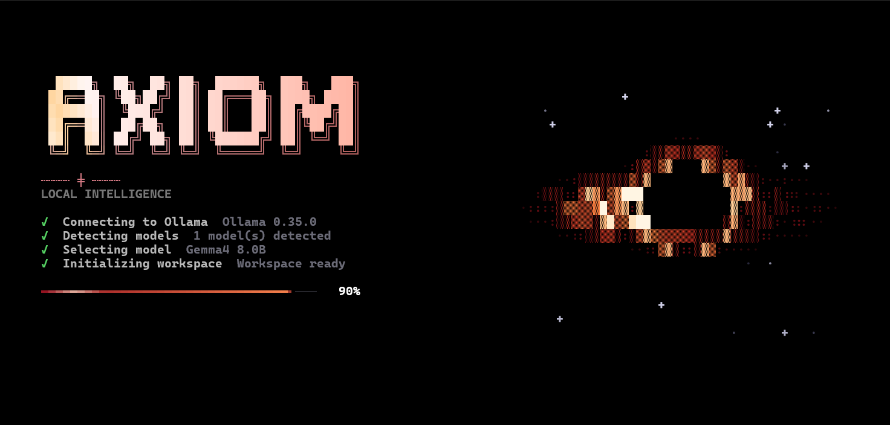
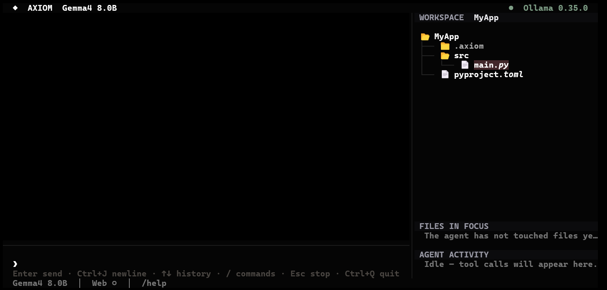

# TUI — руководство пользователя

Запуск: `axiom` (или `python -m axiom`).

---

## Заставка

При старте показывается анимированная ASCII-чёрная дыра (вращающийся диск,
линзированная дуга, мерцающие звёзды; скрывается на терминалах уже 112
колонок), логотип с бегущим бликом и **реальная** последовательность проверок.
Под шагами — плавный прогресс-бар (lerp к реальному прогрессу, внутри
выполняющегося шага медленно «подползает», но никогда не показывает 100 % до
завершения). Заставка держится минимум 2.4 с и ещё ~0.9 с показывает «Ready»,
чтобы её можно было рассмотреть; любая клавиша пропускает паузу. При
`animations = false` пауз нет.

```text
✓ Connecting to Ollama      ← GET /api/version
✓ Detecting models          ← GET /api/tags
✓ Selecting model           ← конфиг или первая доступная
✓ Initializing workspace
Starting AXIOM …
```

Каждый шаг отражает фактический результат: `✓` — успех, `✕` — ошибка с
пояснением. Если Ollama недоступна, появляются кнопки **Retry** / **Exit**
(стрелки ← →, Enter, либо мышь) — приложение не падает с traceback.



## Главный экран

```text
┌──────────────────────────────────────────────────────────┐
│ AXIOM   ›  Deepseek R1 8B              ●  Ollama 0.34.0  │  header
├──────────────────────────────────────────────────────────┤
│  YOU · 14:03                                             │
│    Объясни, как работает asyncio                         │  пользователь
│                                                          │
│  AXIOM                                                   │
│  ▸ Thinking ✓  4.8s          ← только если был reasoning │  сворачивается
│  ┌ WEB SEARCH ─────────────────────────────┐             │  (если был поиск)
│  │ ✓ Search  latest python news · 5 sources│             │
│  │ 01  python.org                          │             │  кликабельно
│  └─────────────────────────────────────────┘             │
│  ANSWER                                                  │
│  asyncio — это библиотека Python …                       │  streaming
│  4.8s  2.4k tok  18.6 tok/s                              │  метрики
├──────────────────────────────────────────────────────────┤
│ ❯ Напишите сообщение…                       [Stop]       │  prompt
│ Enter send · Ctrl+J newline · / commands · Ctrl+Q quit   │
├──────────────────────────────────────────────────────────┤
│ ● Ollama 0.34.0 · Deepseek R1 8B · 2.4k tok · Thinking ◌ │  status bar
└──────────────────────────────────────────────────────────┘
```

Важные детали:

* блок **Thinking** существует только если модель реально прислала reasoning;
  после завершения он сворачивается в `Thinking ✓ 4.8s` и раскрывается кликом;
* блок **WEB SEARCH** появляется только при реальном поиске; источники
  кликабельны — открываются в браузере;
* статусная строка показывает только реальные метрики из финального события
  Ollama (токены, tok/s), никаких оценок;
* во время генерации рядом с промптом появляется кнопка **Stop**;
  `Ctrl+C` в этот момент тоже останавливает генерацию (вне генерации
  `Ctrl+C` работает как обычно, выход — `Ctrl+Q`).



## Клавиатура и мышь

| Действие | Клавиши |
|---|---|
| Отправить сообщение | `Enter` |
| Перенос строки в промпте | `Ctrl+J` / `Alt+Enter` |
| Открыть меню команд | введите `/` |
| Перемещение по меню команд | `↑` `↓` |
| Дополнить команду | `Tab` / `Enter` |
| Закрыть меню / панель | `Esc` |
| Остановить генерацию | `Ctrl+C` (во время генерации) или кнопка Stop |
| Выйти | `Ctrl+Q` |
| Прокрутка чата/источников | колесо мыши, `PgUp`/`PgDn` |
| Следовать за новым выводом | `End` (когда отоскроллились вверх) |
| Поиск по текущему транскрипту | `Ctrl+F`, затем `Enter` / `Shift+Enter` для перехода |
| Показать / скрыть правую панель | `Ctrl+B` или `/panel` |

## Рабочая папка

Пока папка не выбрана, правая панель пуста: в ней кнопка **＋ Add project folder**
и список недавних проектов (клик — открыть). Когда проект открыт, над деревом
есть кнопки **＋ Open another** и **✕ Close**.
`/open` или `Ctrl+O` открывает выбор папки: путь можно ввести или вставить,
пройтись по дереву стрелками, перейти в «Домашнюю», «Папку запуска», другие
диски (Windows) или недавние проекты. `/open <путь>` открывает сразу.
После выбора агент читает, правит файлы и запускает команды только в этой
папке, выбор сохраняется в конфиге. `/close` — закрыть папку (глобальный чат
без файловых инструментов).

## Аккаунт, баланс и AXIOM PRO

`/account` (или `/login`, `/register`) — тот же аккаунт, что и в desktop:
вход по логину и паролю, регистрация с индикатором надёжности пароля, вход
через GitHub / Google (ссылка открывается в браузере, экран сам завершает
вход). После входа видны баланс AXIOM USD-кредитов, статус PRO с остатком
дней, оплата PRO (990 ₽ / 30 дней картой или $9.90 с баланса) и пополнение
(100 / 250 / 500 / 1000 ₽ или своя сумма). Оплата проходит на странице
ЮMoney, экран опрашивает заказ до подтверждения сервером. `/pro` и
`/topup [сумма]` открывают нужный раздел сразу. Токен хранится в
`~/.axiom/account.json`; в шапке показывается имя, баланс и `★ PRO`.

## Правая панель (workspace)

Справа — панель рабочего пространства (на узких терминалах < 110 колонок
скрывается автоматически, `Ctrl+B` показывает принудительно). Дерево
показывает все файлы проекта (скрыты только `.git` и `__pycache__`) и само
обновляется, когда файлы появляются, удаляются или переименовываются:

* **WORKSPACE** — дерево открытой папки; клик по файлу вставляет `@путь` в промпт;
* **FILES IN FOCUS** — файлы, которые агент реально читал (`R`), правил (`E`),
  создавал (`W`) или удалял (`D`); `▸` — последний;
* **AGENT ACTIVITY** — живой журнал вызовов инструментов со статусом и спиннером.

## Инструменты в чате

Каждый вызов инструмента — отдельный блок в хронологии ответа:
`⌕ Search «query» · N matches` с найденными строками, `▤ Read path L1–40`,
`✎ Edit path +3 -1` с мини-диффом, `✚ Write` с первыми строками,
`❯ Run $ command` с хвостом вывода (красным при ошибке). Превью строятся только
из реальных аргументов и результата инструмента.

## Slash-команды

Введите `/` — появится меню, сгруппированное по разделам (General, Chat,
Models, Settings, Extensions, Agents, System), с фильтрацией по мере набора:

| Команда | Описание |
|---|---|
| `/help` | справка: команды и управление |
| `/model [name]` | сменить модель (с аргументом — сразу, без — панель выбора) |
| `/models` | панель моделей: параметры, размер, capabilities, `r` — refresh |
| `/clear` | очистить диалог (начать новый) |
| `/history` | история разговоров: Enter — открыть, `d` — удалить |
| `/new` | новый разговор |
| `/settings` | настройки (сохраняются сразу) |
| `/theme [accent]` | сменить акцент (`garnet`, `blue`, `teal`, `violet`, `slate`, `rose`, `amber`); без аргумента — следующий |
| `/animations [on\|off]` | включить / выключить анимации (без аргумента — переключить) |
| `/panel` | показать / скрыть правую панель workspace |
| `/open [path]` | выбрать рабочую папку (без аргумента — окно выбора, `Ctrl+O`) |
| `/close` | закрыть папку — глобальный чат без файловых инструментов |
| `/account` `/login` `/register` | аккаунт: вход, регистрация, баланс, PRO |
| `/pro` | оформить / продлить AXIOM PRO |
| `/topup [сумма]` | пополнить баланс |
| `/search <query>` | отправить сообщение с принудительным web search |
| `/status` | статус: сервер, модель, capabilities, метрики последней генерации |
| `/permissions` | панель режима разрешений; Enter применяет `ask` / `auto_approve_safe` / `auto_approve_all` |
| `/profiles` | профили системного промпта: Enter — применить выбранный |
| `/trajectory` | Trajectory Viewer: RUN id, шаги с временем, usage; Enter — детали шага |
| `/providers` | Provider Manager: статусы, Enter — Test, ввод API-ключа (скрытый) → Save key & test, Discover models → выбор модели |
| `/agents` | Agent Registry: роли, провайдер/модель, набор инструментов |
| `/plugins` | Plugin Manager: установка из папки, включение/выключение, удаление; `?` — документация плагина |
| `/memory` | Curated Memory: список, `a` добавить, `e` изменить, `d` удалить |
| `/knowledge` | Knowledge Base: коллекции, индексирование и поиск цитат |
| `/orchestrate <task>` | Live-панель trajectory: реальные события analyst/coder/debugger/tester/reviewer; `s` — остановить |
| `/benchmark [repetitions]` | Реальный cold/warm benchmark через отдельные `ChatSession`; показывает только измеренные runs и ошибки |
| `/exit` | выход |

В панелях работает навигация стрелками, выбор — `Enter`, закрытие — `Esc`.

## Настройки (`/settings`)

* Web search — вкл/выкл;
* Show reasoning — показывать ли reasoning;
* Reasoning starts expanded — раскрывать блок сразу;
* Animations — спиннеры и анимация заставки;
* Save conversation history — персистентность диалогов;
* Temperature — число 0…2 или пусто (по умолчанию модели);
* System prompt — системный промпт или пусто (встроенный).

Все изменения применяются немедленно и сохраняются в `config.json`.
Подробности полей — в [configuration.md](configuration.md).
